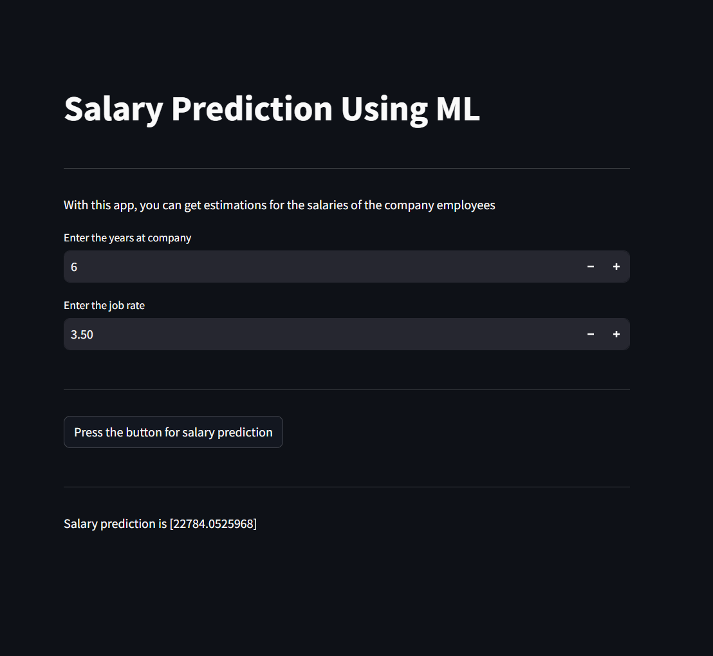

# Employee Salary Prediction using Machine Learning

This project is a part of an internship that focuses on predicting employee salaries based on various factors using machine learning techniques. It includes a complete ML pipeline from data analysis to model training and deployment using Streamlit.

---

## 🖼️ Screenshot

Here is a preview of the Streamlit app:



---

## 📌 Overview

The goal of this project is to predict employee salary based on features such as years at company and job rate. A linear regression model is trained and deployed using a simple web application.

---

## 📊 Dataset

- The dataset used in this project can be found at:  
  [Kaggle - Company Employees Dataset](https://www.kaggle.com/datasets/abdallahwagih/company-employees)

- Local file used: `Employees.xlsx`

---

## 🧪 Notebooks

- `Analysis_Modelling.ipynb`: Contains complete data analysis, preprocessing, feature engineering, model training, evaluation, and model saving using `joblib`.

---

## 🛠️ Technologies Used

- Python
- Scikit-learn
- Pandas, NumPy
- Streamlit (for deployment)
- Joblib (for saving the trained model)
- Jupyter Notebook

---

## 📦 Files Included

| File Name            | Description |
|---------------------|-------------|
| `app.py`            | Streamlit app to predict salary using the trained ML model |
| `linearmodel.pkl`   | Serialized trained linear regression model |
| `Employees.xlsx`    | Dataset used for training |
| `Analysis_Modelling.ipynb` | Jupyter notebook containing analysis and model training code |
| `data.txt`          | Source link of the dataset used |

---

## 🚀 How to Run the App

1. **Install dependencies**
   ```bash
   pip install streamlit scikit-learn pandas numpy joblib
2. **Run Streamlit Web app**
    ```bash
    streamlit run app.py
